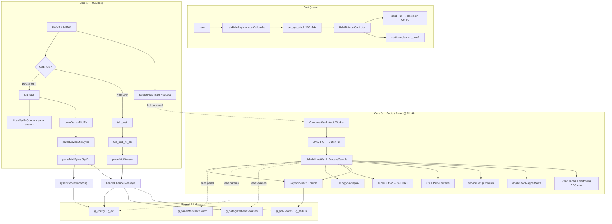
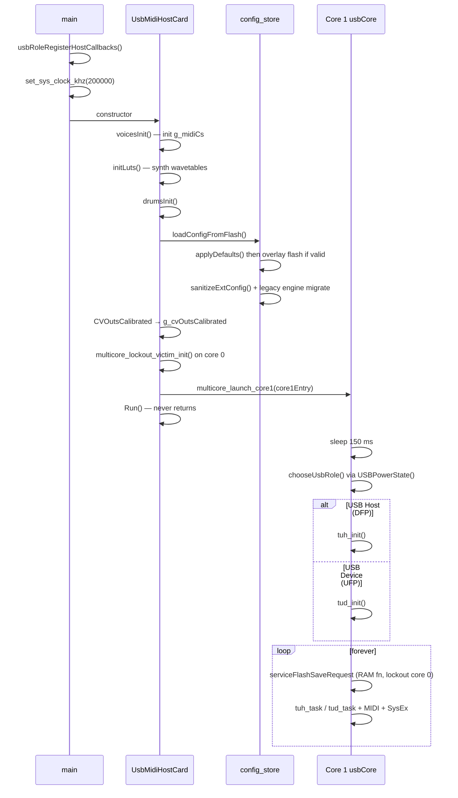
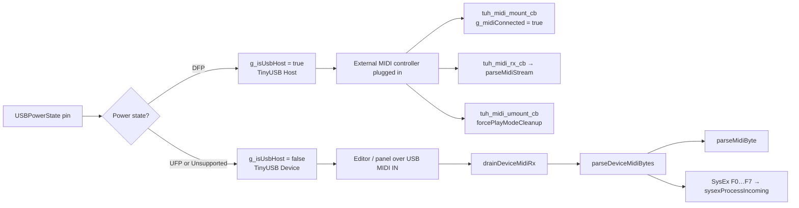
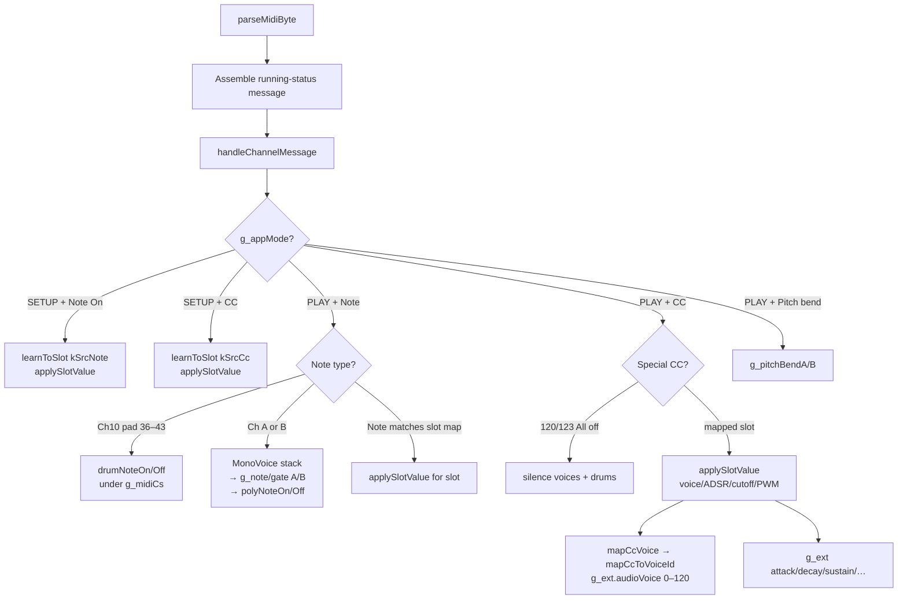
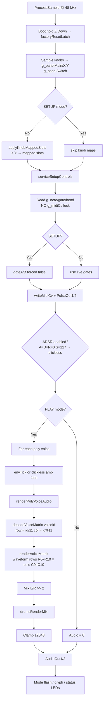
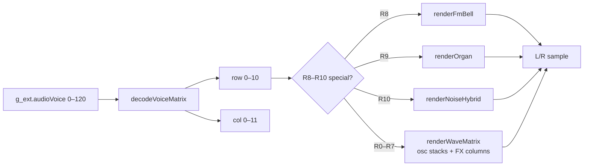
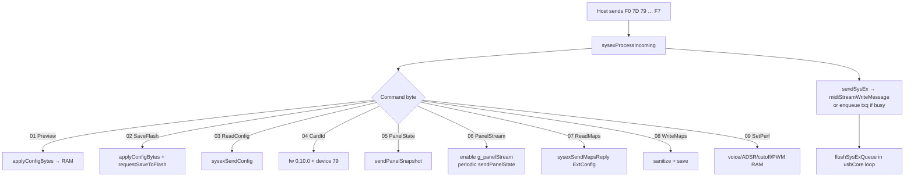
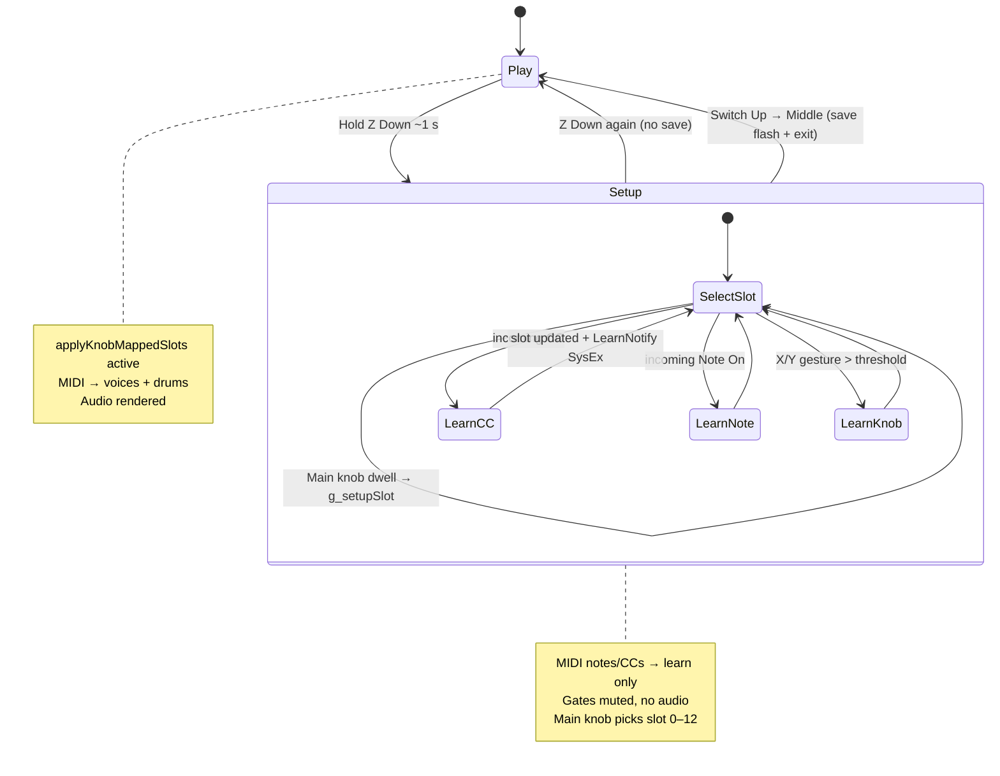
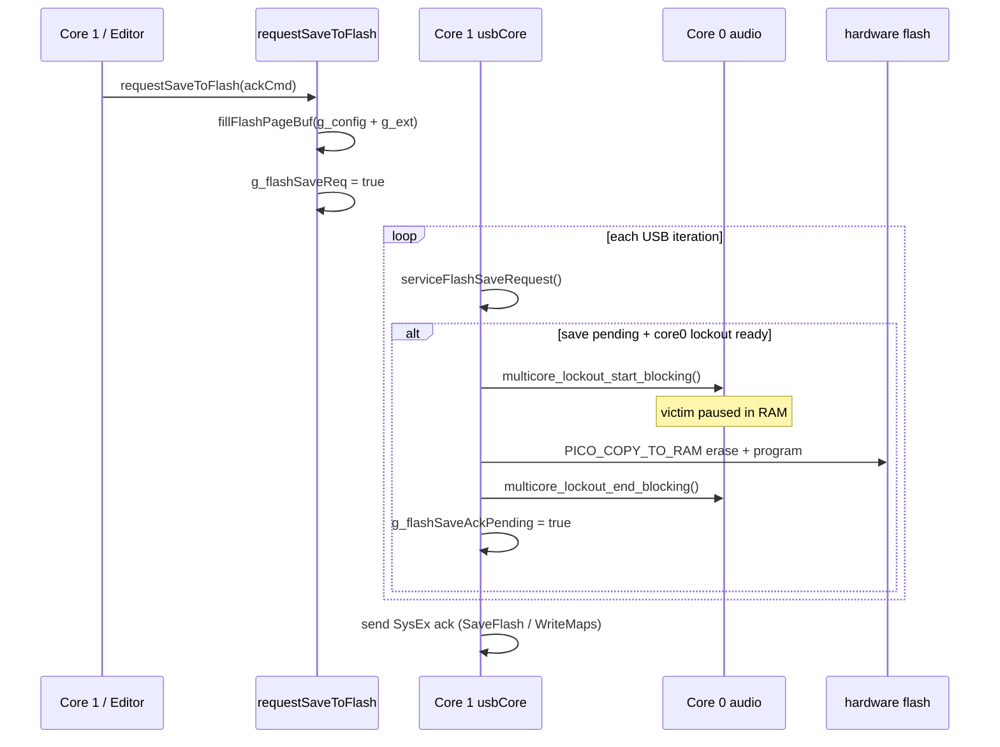
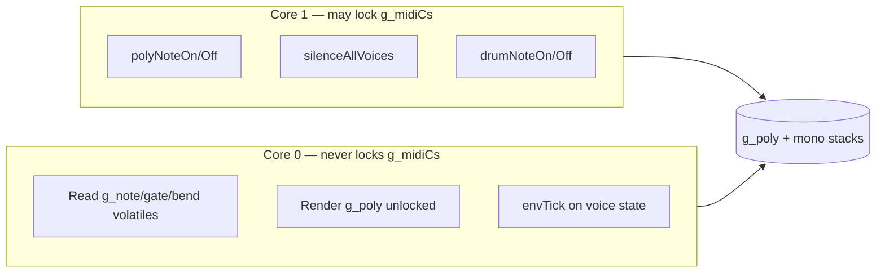

# 92 USB MIDI Host Synth — Control Flow

USB MIDI Host Synth (release **92**, SysEx device ID **79**). This document
describes how the firmware is structured, how the two RP2040 cores interact,
and how MIDI, panel I/O, audio, and configuration flow through the system.

Firmware **0.10.x** — see also [`VOICE_MATRIX.md`](VOICE_MATRIX.md) for the
121-patch voice matrix spec. Operator guide: [`../features/voice-matrix.md`](../features/voice-matrix.md).

**Clock:** firmware runs at **200 MHz** (not the AGENTS default 144 MHz) to
leave headroom for four poly voices, drum synthesis, and per-voice character FX
at 48 kHz while core 1 services TinyUSB host/device. Firmware is built
**flash-resident** (no `copy_to_ram`) — same rationale as `82_Computer_Grids`
to avoid USB/core timing surprises.

**ComputerCard:** vendored `ComputerCard.h` + `ComputerCardImpl.cpp` at the
release root (v0.2.8 from the repo framework).

---

## Architecture summary

The app runs on **two RP2040 cores** with a strict split:

| Core | Role | Main loop |
|------|------|-----------|
| **Core 0** | Real-time audio / panel I/O | `ComputerCard::Run()` → DMA ISR @ **48 kHz** → `ProcessSample()` |
| **Core 1** | USB + editor comms | `usbCore()` forever loop |

Shared state lives in **`runtime_state`** volatiles and **`g_config` / `g_ext`**.
Voice allocation uses **`g_midiCs`** on Core 1 only — Core 0 deliberately
**never** locks it during audio (blocking the ADC mux caused knob flutter).

---

## 1. System overview

---

## 2. Startup sequence

**Source files:** `main.cpp`, `config_store.cpp`, `voices.cpp`, `synth.cpp`,
`drums.cpp`, `usb_role.cpp`.

---

## 3. USB role selection

In **host mode**, MIDI arrives from a connected controller via TinyUSB host
callbacks (`usb_role.cpp`, `usb_midi_host.c`).

In **device mode**, the Workshop Computer presents as a USB MIDI device to a
host PC running `web/index.html`. Incoming bytes are drained in the Core 1 loop
and never parsed re-entrantly during TX (`main.cpp`).

---

## 4. MIDI ingress and routing

**13 parameter slots** (`protocol.h`): Ch A, Ch B, bend range, voice (CC 24
default), ADSR, cutoff, PWM — each mapped to CC,
Note, Knob X, or Knob Y via `ExtConfig.slots[]`.

**Source files:** `midi_parser.cpp`, `param_maps.cpp`, `voices.cpp`,
`drums.cpp`.

---

## 5. Audio ISR — `ProcessSample()` pipeline

**Voice matrix render path:**

**Source files:** `main.cpp`, `adsr.cpp`, `synth.cpp`, `voice_matrix.cpp`,
`drums.cpp`.

---

## 6. SysEx editor protocol (device mode)

**Panel streaming:** Core 0 updates `g_panel*` every sample; Core 1 sends
`kCmdPanelState` SysEx (throttled / on change) back to `web/index.html`.

**Source files:** `sysex_editor.cpp`, `main.cpp`, `protocol.h`.

---

## 7. SETUP mode state machine

**Source files:** `main.cpp` (`serviceSetupControls`), `param_maps.cpp`.

---

## 8. Flash persistence

Flash writes run from the **core 1 USB loop**, not the audio ISR. Core 0 is the
lockout victim (paused in RAM during erase/program). The erase/program helper
lives in RAM (`PICO_COPY_TO_RAM`) so XIP suspend is safe. Config lives in the
last flash sector (`config_store.cpp`).

---

## 9. Synchronization rules

Core 1 holds `g_midiCs` only briefly while mutating voice allocation. Core 0
reads MIDI state from volatiles and renders poly voices **without** taking the
lock — spinning on the lock in `ProcessSample` would stall the ADC knob mux.

---

## Source file map

| File | Responsibility |
|------|----------------|
| `main.cpp` | Bootstrap: clock, host callbacks, construct card, `Run()` |
| `app/card.cpp` | `UsbMidiHostCard` ctor, `ProcessSample`, CV output |
| `app/panel_setup.cpp` | SETUP toggle, knob learn slot select, factory-reset latch |
| `usb/usb_core1.cpp` | Core 1 USB loop, role select, flash-save ack |
| `usb/usb_device_midi.cpp` | Device-mode SysEx TX queue, panel stream, RX parse |
| `app/runtime_state.cpp` | Cross-core volatile globals |
| `app/config_store.cpp` | Flash load/save, defaults, sanitization |
| `app/midi_parser.cpp` | Byte stream → channel messages |
| `app/param_maps.cpp` | Slot maps, knob learn, `handleChannelMessage` |
| `app/sysex_editor.cpp` | Editor SysEx command dispatch |
| `usb/usb_role.cpp` | USB host MIDI callbacks |
| `dsp/voices.cpp` | Mono/poly voice allocation, `g_midiCs` |
| `dsp/voice_matrix.cpp` | CC → row/col decode, legacy migrate |
| `dsp/synth.cpp` | Oscillator matrix renderer |
| `dsp/adsr.cpp` | Envelope per voice |
| `dsp/drums.cpp` | Ch10 drum kit |
| `app/glyph_leds.cpp` | Stroke digit LED animations |
| `protocol.h` | SysEx commands, slots, config structs |
| `sysex_spec.json` | Machine-readable editor/firmware contract |
| `web/index.html`, `web/app.js`, `web/styles.css` | Browser editor UI |
