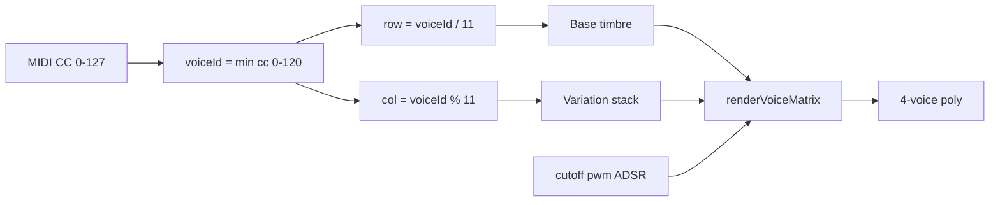

# 121 Voice Matrix — Design Spec

Developer reference. For patch selection and everyday use, see [`../features/voice-matrix.md`](../features/voice-matrix.md).

USB MIDI Host program card **79**. Source of truth for the 11×11 voice system:
**11 base timbres (rows)** × **11 classic synth variations (columns)** = **121
patches**, addressable by MIDI CC **0–120** on the Audio engine slot (factory
**CC 24** Omni).

Implemented in firmware **0.10.x** — replaces 13 monolithic engines in `synth.cpp`.

---

## 1. Overview

The matrix is **11 voices**, each with **11 FX/osc stacks** — not 121 unrelated
engines. CC *n* → row `n / 11`, column `n % 11`.

- **Rows R0–R7:** waveform families
- **Rows R8–R10:** special sources (FM bell, organ, noise)
- **Columns C0–C10:** universal classic synth stacks

Global **ADSR**, **cutoff**, **PWM** remain bus-level modulators.

---

## 2. Architecture



---

## 3. CC mapping

| CC | Behavior |
|----|----------|
| 0–120 | `voiceId = cc`; row = cc/11; col = cc%11 |
| 121–126 | Reserved — hold last voice |
| 127 | Factory default CC 0 (Pulse Pure) |

---

## 4. Row reference

| Row | Name | Source |
|-----|------|--------|
| R0 | Pulse | Variable PWM (`pwmWidth`) |
| R1 | Square | 50% square |
| R2 | Sine | Sine LUT |
| R3 | Saw | PolyBLEP saw |
| R4 | Triangle | Triangle |
| R5 | Narrow pulse | ~15% duty |
| R6 | Bright saw | Saw + soft clip |
| R7 | Hollow | Triangle + weak square |
| R8 | FM bell | 2-op sine FM |
| R9 | Organ stack | Drawbar sines |
| R10 | Noise hybrid | Osc + filtered noise |

---

## 5. Column reference

| Col | Name | Stack |
|-----|------|-------|
| C0 | Pure | 1 osc |
| C1 | Dual | 2 osc same pitch |
| C2 | Triple | 3 osc same pitch |
| C3 | Detune | 2 osc ±12¢ |
| C4 | Sub | Main + square −1 oct |
| C5 | Octave | Main + +1 oct |
| C6 | Unison | 4× ±8¢ |
| C7 | Lowpass | SVF LPF + filter env |
| C8 | Chorus | Stereo ensemble |
| C9 | Glide | Portamento |
| C10 | Sync/FM | Row-dependent (§8) |

---

## 6. CC grid (Row × Col)

**Y axis (rows)** = base timbre · **X axis (columns)** = variation stack.
Cell = MIDI CC value on the Audio engine map (factory CC 24). Formula: `CC = row×11 + col`.

| Row \\ Col | **C0**<br>Pure | **C1**<br>Dual | **C2**<br>Triple | **C3**<br>Detune | **C4**<br>Sub | **C5**<br>Octave | **C6**<br>Unison | **C7**<br>LP | **C8**<br>Chorus | **C9**<br>Glide | **C10**<br>Sync/FM |
|---|---|---|---|---|---|---|---|---|---|---|---|
| **R0**<br>Pulse | **0**<br>R0·C0 | **1**<br>R0·C1 | **2**<br>R0·C2 | **3**<br>R0·C3 | **4**<br>R0·C4 | **5**<br>R0·C5 | **6**<br>R0·C6 | **7**<br>R0·C7 | **8**<br>R0·C8 | **9**<br>R0·C9 | **10**<br>R0·C10 |
| **R1**<br>Square | **11**<br>R1·C0 | **12**<br>R1·C1 | **13**<br>R1·C2 | **14**<br>R1·C3 | **15**<br>R1·C4 | **16**<br>R1·C5 | **17**<br>R1·C6 | **18**<br>R1·C7 | **19**<br>R1·C8 | **20**<br>R1·C9 | **21**<br>R1·C10 |
| **R2**<br>Sine | **22**<br>R2·C0 | **23**<br>R2·C1 | **24**<br>R2·C2 | **25**<br>R2·C3 | **26**<br>R2·C4 | **27**<br>R2·C5 | **28**<br>R2·C6 | **29**<br>R2·C7 | **30**<br>R2·C8 | **31**<br>R2·C9 | **32**<br>R2·C10 |
| **R3**<br>Saw | **33**<br>R3·C0 | **34**<br>R3·C1 | **35**<br>R3·C2 | **36**<br>R3·C3 | **37**<br>R3·C4 | **38**<br>R3·C5 | **39**<br>R3·C6 | **40**<br>R3·C7 | **41**<br>R3·C8 | **42**<br>R3·C9 | **43**<br>R3·C10 |
| **R4**<br>Triangle | **44**<br>R4·C0 | **45**<br>R4·C1 | **46**<br>R4·C2 | **47**<br>R4·C3 | **48**<br>R4·C4 | **49**<br>R4·C5 | **50**<br>R4·C6 | **51**<br>R4·C7 | **52**<br>R4·C8 | **53**<br>R4·C9 | **54**<br>R4·C10 |
| **R5**<br>Narrow | **55**<br>R5·C0 | **56**<br>R5·C1 | **57**<br>R5·C2 | **58**<br>R5·C3 | **59**<br>R5·C4 | **60**<br>R5·C5 | **61**<br>R5·C6 | **62**<br>R5·C7 | **63**<br>R5·C8 | **64**<br>R5·C9 | **65**<br>R5·C10 |
| **R6**<br>Bright saw | **66**<br>R6·C0 | **67**<br>R6·C1 | **68**<br>R6·C2 | **69**<br>R6·C3 | **70**<br>R6·C4 | **71**<br>R6·C5 | **72**<br>R6·C6 | **73**<br>R6·C7 | **74**<br>R6·C8 | **75**<br>R6·C9 | **76**<br>R6·C10 |
| **R7**<br>Hollow | **77**<br>R7·C0 | **78**<br>R7·C1 | **79**<br>R7·C2 | **80**<br>R7·C3 | **81**<br>R7·C4 | **82**<br>R7·C5 | **83**<br>R7·C6 | **84**<br>R7·C7 | **85**<br>R7·C8 | **86**<br>R7·C9 | **87**<br>R7·C10 |
| **R8**<br>FM bell | **88**<br>R8·C0 | **89**<br>R8·C1 | **90**<br>R8·C2 | **91**<br>R8·C3 | **92**<br>R8·C4 | **93**<br>R8·C5 | **94**<br>R8·C6 | **95**<br>R8·C7 | **96**<br>R8·C8 | **97**<br>R8·C9 | **98**<br>R8·C10 |
| **R9**<br>Organ | **99**<br>R9·C0 | **100**<br>R9·C1 | **101**<br>R9·C2 | **102**<br>R9·C3 | **103**<br>R9·C4 | **104**<br>R9·C5 | **105**<br>R9·C6 | **106**<br>R9·C7 | **107**<br>R9·C8 | **108**<br>R9·C9 | **109**<br>R9·C10 |
| **R10**<br>Noise | **110**<br>R10·C0 | **111**<br>R10·C1 | **112**<br>R10·C2 | **113**<br>R10·C3 | **114**<br>R10·C4 | **115**<br>R10·C5 | **116**<br>R10·C6 | **117**<br>R10·C7 | **118**<br>R10·C8 | **119**<br>R10·C9 | **120**<br>R10·C10 |

ASCII view (CC numbers only):

```
        C0  C1  C2  C3  C4  C5  C6  C7  C8  C9  C10
R0  Pulse         0   1   2   3   4   5   6   7   8   9  10
R1  Square       11  12  13  14  15  16  17  18  19  20  21
R2  Sine         22  23  24  25  26  27  28  29  30  31  32
R3  Saw          33  34  35  36  37  38  39  40  41  42  43
R4  Triangle     44  45  46  47  48  49  50  51  52  53  54
R5  Narrow       55  56  57  58  59  60  61  62  63  64  65
R6  Bright saw   66  67  68  69  70  71  72  73  74  75  76
R7  Hollow       77  78  79  80  81  82  83  84  85  86  87
R8  FM bell      88  89  90  91  92  93  94  95  96  97  98
R9  Organ        99 100 101 102 103 104 105 106 107 108 109
R10 Noise       110 111 112 113 114 115 116 117 118 119 120
```

---

## 7. Full 11×11 matrix

| Base \\ Variation | Pure | Dual | Triple | Detune | Sub | Octave | Unison | Lowpass | Chorus | Glide | Sync/FM |
|---|---|---|---|---|---|---|---|---|---|---|---|
| **Pulse** (R0) | CC0: 1× Variable-PWM pulse | CC1: 2× Variable-PWM pulse | CC2: 3× Variable-PWM pulse | CC3: 2× Variable-PWM pulse, ±12¢ | CC4: Variable-PWM pulse + sub −1 oct | CC5: Variable-PWM pulse + +1 oct | CC6: 4× Variable-PWM pulse unison | CC7: Variable-PWM pulse + LPF env | CC8: Variable-PWM pulse + chorus | CC9: Variable-PWM pulse + glide | CC10: hard sync |
| **Square** (R1) | CC11: 1× 50% square | CC12: 2× 50% square | CC13: 3× 50% square | CC14: 2× 50% square, ±12¢ | CC15: 50% square + sub −1 oct | CC16: 50% square + +1 oct | CC17: 4× 50% square unison | CC18: 50% square + LPF env | CC19: 50% square + chorus | CC20: 50% square + glide | CC21: hard sync |
| **Sine** (R2) | CC22: 1× Sine LUT | CC23: 2× Sine LUT | CC24: 3× Sine LUT | CC25: 2× Sine LUT, ±12¢ | CC26: Sine LUT + sub −1 oct | CC27: Sine LUT + +1 oct | CC28: 4× Sine LUT unison | CC29: Sine LUT + LPF env | CC30: Sine LUT + chorus | CC31: Sine LUT + glide | CC32: 2-op FM |
| **Saw** (R3) | CC33: 1× PolyBLEP saw | CC34: 2× PolyBLEP saw | CC35: 3× PolyBLEP saw | CC36: 2× PolyBLEP saw, ±12¢ | CC37: PolyBLEP saw + sub −1 oct | CC38: PolyBLEP saw + +1 oct | CC39: 4× PolyBLEP saw unison | CC40: PolyBLEP saw + LPF env | CC41: PolyBLEP saw + chorus | CC42: PolyBLEP saw + glide | CC43: hard sync |
| **Triangle** (R4) | CC44: 1× Triangle | CC45: 2× Triangle | CC46: 3× Triangle | CC47: 2× Triangle, ±12¢ | CC48: Triangle + sub −1 oct | CC49: Triangle + +1 oct | CC50: 4× Triangle unison | CC51: Triangle + LPF env | CC52: Triangle + chorus | CC53: Triangle + glide | CC54: cross-mod FM |
| **Narrow pulse** (R5) | CC55: 1× Fixed ~15% duty | CC56: 2× Fixed ~15% duty | CC57: 3× Fixed ~15% duty | CC58: 2× Fixed ~15% duty, ±12¢ | CC59: Fixed ~15% duty + sub −1 oct | CC60: Fixed ~15% duty + +1 oct | CC61: 4× Fixed ~15% duty unison | CC62: Fixed ~15% duty + LPF env | CC63: Fixed ~15% duty + chorus | CC64: Fixed ~15% duty + glide | CC65: hard sync |
| **Bright saw** (R6) | CC66: 1× Saw + soft clip | CC67: 2× Saw + soft clip | CC68: 3× Saw + soft clip | CC69: 2× Saw + soft clip, ±12¢ | CC70: Saw + soft clip + sub −1 oct | CC71: Saw + soft clip + +1 oct | CC72: 4× Saw + soft clip unison | CC73: Saw + soft clip + LPF env | CC74: Saw + soft clip + chorus | CC75: Saw + soft clip + glide | CC76: hard sync |
| **Hollow** (R7) | CC77: 1× Triangle + weak square | CC78: 2× Triangle + weak square | CC79: 3× Triangle + weak square | CC80: 2× Triangle + weak square, ±12¢ | CC81: Triangle + weak square + sub −1 oct | CC82: Triangle + weak square + +1 oct | CC83: 4× Triangle + weak square unison | CC84: Triangle + weak square + LPF env | CC85: Triangle + weak square + chorus | CC86: Triangle + weak square + glide | CC87: cross-mod FM |
| **FM bell** (R8) | CC88: bell | CC89: dual FM | CC90: triple FM | CC91: det FM | CC92: FM+sub | CC93: FM+oct | CC94: FM unison | CC95: FM+LPF | CC96: FM+chorus | CC97: FM glide | CC98: metallic FM |
| **Organ stack** (R9) | CC99: drawbars | CC100: 8′ double | CC101: 2′ emphasis | CC102: det 8′ | CC103: 16′ sub | CC104: bright 4′+2′ | CC105: wide organ | CC106: organ LPF | CC107: celeste | CC108: organ glide | CC109: Leslie spread |
| **Noise hybrid** (R10) | CC110: noise+osc | CC111: dual noise | CC112: noise+sub | CC113: det noise | CC114: sub noise | CC115: oct shimmer | CC116: noise cloud | CC117: noise sweep | CC118: breath chorus | CC119: noise glide | CC120: BP sweep |

---

## 8. Column 10 — row groups

| Rows | C10 behavior |
|------|----------------|
| R0,R1,R3,R5,R6 | Hard sync; ratio from PWM |
| R2,R4,R7 | 2-op FM / cross-mod; index from cutoff |
| R8 | High-ratio metallic FM |
| R9 | Detuned drawbar spread |
| R10 | BP noise sweep from cutoff |

---

## 9. Hero cells (validate first)

| CC | Cell | Old engine | Notes |
|----|------|------------|-------|
| 0 | R0C0 | 0 Square/pulse | Default |
| 4 | R0C4 | 5 Pulse+sub | Juno raw |
| 8 | R0C8 | 9 Junoish | Chorus |
| 22 | R2C0 | 1 Sine | |
| 25 | R2C3 | 6 Dual sine | |
| 32 | R2C10 | 12 FM bell | FM from sine |
| 33 | R3C0 | 2 Saw | |
| 36 | R3C3 | 4 Dual saw | |
| 37 | R3C4 | 7 Saw+sub | |
| 40 | R3C7 | 8 Moogish | |
| 42 | R3C9 | 11 Acid | Glide half of acid |
| 43 | R3C10 | 10 Sync | |
| 88 | R8C0 | 12 FM bell | Bell row |

---

## 10. Legacy mapping (v0.8.x)

| Old | Name | CC | Cell |
|-----|------|-----|------|
| 0 | Square/pulse | 0 | R0C0 |
| 1 | Sine | 22 | R2C0 |
| 2 | Saw | 33 | R3C0 |
| 3 | Triangle | 44 | R4C0 |
| 4 | Dual saw | 36 | R3C3 |
| 5 | Pulse+sub | 4 | R0C4 |
| 6 | Dual sine | 25 | R2C3 |
| 7 | Saw+sub | 37 | R3C4 |
| 8 | Moogish | 40 | R3C7 |
| 9 | Junoish | 8 | R0C8 |
| 10 | Sync | 43 | R3C10 |
| 11 | Acid | 42 | R3C9 |
| 12 | FM bell | 88 | R8C0 |

---

## 11. Global parameters

| Param | Use |
|-------|-----|
| ADSR | Amplitude (bus) |
| Cutoff | C7, C10; gentle tone on Pure |
| PWM | R0, R5; sync ratio on C10 |
| Decay | Filter env depth |

---

## 12. CC quick reference

| CC | Row | Col | Name |
|----|-----|-----|------|
| 0 | R0 Pulse | C0 Pure | Pulse + Pure |
| 1 | R0 Pulse | C1 Dual | Pulse + Dual |
| 2 | R0 Pulse | C2 Triple | Pulse + Triple |
| 3 | R0 Pulse | C3 Detune | Pulse + Detune |
| 4 | R0 Pulse | C4 Sub | Pulse + Sub |
| 5 | R0 Pulse | C5 Octave | Pulse + Octave |
| 6 | R0 Pulse | C6 Unison | Pulse + Unison |
| 7 | R0 Pulse | C7 Lowpass | Pulse + Lowpass |
| 8 | R0 Pulse | C8 Chorus | Pulse + Chorus |
| 9 | R0 Pulse | C9 Glide | Pulse + Glide |
| 10 | R0 Pulse | C10 Sync/FM | Pulse + Sync/FM |
| 11 | R1 Square | C0 Pure | Square + Pure |
| 12 | R1 Square | C1 Dual | Square + Dual |
| 13 | R1 Square | C2 Triple | Square + Triple |
| 14 | R1 Square | C3 Detune | Square + Detune |
| 15 | R1 Square | C4 Sub | Square + Sub |
| 16 | R1 Square | C5 Octave | Square + Octave |
| 17 | R1 Square | C6 Unison | Square + Unison |
| 18 | R1 Square | C7 Lowpass | Square + Lowpass |
| 19 | R1 Square | C8 Chorus | Square + Chorus |
| 20 | R1 Square | C9 Glide | Square + Glide |
| 21 | R1 Square | C10 Sync/FM | Square + Sync/FM |
| 22 | R2 Sine | C0 Pure | Sine + Pure |
| 23 | R2 Sine | C1 Dual | Sine + Dual |
| 24 | R2 Sine | C2 Triple | Sine + Triple |
| 25 | R2 Sine | C3 Detune | Sine + Detune |
| 26 | R2 Sine | C4 Sub | Sine + Sub |
| 27 | R2 Sine | C5 Octave | Sine + Octave |
| 28 | R2 Sine | C6 Unison | Sine + Unison |
| 29 | R2 Sine | C7 Lowpass | Sine + Lowpass |
| 30 | R2 Sine | C8 Chorus | Sine + Chorus |
| 31 | R2 Sine | C9 Glide | Sine + Glide |
| 32 | R2 Sine | C10 Sync/FM | Sine + Sync/FM |
| 33 | R3 Saw | C0 Pure | Saw + Pure |
| 34 | R3 Saw | C1 Dual | Saw + Dual |
| 35 | R3 Saw | C2 Triple | Saw + Triple |
| 36 | R3 Saw | C3 Detune | Saw + Detune |
| 37 | R3 Saw | C4 Sub | Saw + Sub |
| 38 | R3 Saw | C5 Octave | Saw + Octave |
| 39 | R3 Saw | C6 Unison | Saw + Unison |
| 40 | R3 Saw | C7 Lowpass | Saw + Lowpass |
| 41 | R3 Saw | C8 Chorus | Saw + Chorus |
| 42 | R3 Saw | C9 Glide | Saw + Glide |
| 43 | R3 Saw | C10 Sync/FM | Saw + Sync/FM |
| 44 | R4 Triangle | C0 Pure | Triangle + Pure |
| 45 | R4 Triangle | C1 Dual | Triangle + Dual |
| 46 | R4 Triangle | C2 Triple | Triangle + Triple |
| 47 | R4 Triangle | C3 Detune | Triangle + Detune |
| 48 | R4 Triangle | C4 Sub | Triangle + Sub |
| 49 | R4 Triangle | C5 Octave | Triangle + Octave |
| 50 | R4 Triangle | C6 Unison | Triangle + Unison |
| 51 | R4 Triangle | C7 Lowpass | Triangle + Lowpass |
| 52 | R4 Triangle | C8 Chorus | Triangle + Chorus |
| 53 | R4 Triangle | C9 Glide | Triangle + Glide |
| 54 | R4 Triangle | C10 Sync/FM | Triangle + Sync/FM |
| 55 | R5 Narrow pulse | C0 Pure | Narrow pulse + Pure |
| 56 | R5 Narrow pulse | C1 Dual | Narrow pulse + Dual |
| 57 | R5 Narrow pulse | C2 Triple | Narrow pulse + Triple |
| 58 | R5 Narrow pulse | C3 Detune | Narrow pulse + Detune |
| 59 | R5 Narrow pulse | C4 Sub | Narrow pulse + Sub |
| 60 | R5 Narrow pulse | C5 Octave | Narrow pulse + Octave |
| 61 | R5 Narrow pulse | C6 Unison | Narrow pulse + Unison |
| 62 | R5 Narrow pulse | C7 Lowpass | Narrow pulse + Lowpass |
| 63 | R5 Narrow pulse | C8 Chorus | Narrow pulse + Chorus |
| 64 | R5 Narrow pulse | C9 Glide | Narrow pulse + Glide |
| 65 | R5 Narrow pulse | C10 Sync/FM | Narrow pulse + Sync/FM |
| 66 | R6 Bright saw | C0 Pure | Bright saw + Pure |
| 67 | R6 Bright saw | C1 Dual | Bright saw + Dual |
| 68 | R6 Bright saw | C2 Triple | Bright saw + Triple |
| 69 | R6 Bright saw | C3 Detune | Bright saw + Detune |
| 70 | R6 Bright saw | C4 Sub | Bright saw + Sub |
| 71 | R6 Bright saw | C5 Octave | Bright saw + Octave |
| 72 | R6 Bright saw | C6 Unison | Bright saw + Unison |
| 73 | R6 Bright saw | C7 Lowpass | Bright saw + Lowpass |
| 74 | R6 Bright saw | C8 Chorus | Bright saw + Chorus |
| 75 | R6 Bright saw | C9 Glide | Bright saw + Glide |
| 76 | R6 Bright saw | C10 Sync/FM | Bright saw + Sync/FM |
| 77 | R7 Hollow | C0 Pure | Hollow + Pure |
| 78 | R7 Hollow | C1 Dual | Hollow + Dual |
| 79 | R7 Hollow | C2 Triple | Hollow + Triple |
| 80 | R7 Hollow | C3 Detune | Hollow + Detune |
| 81 | R7 Hollow | C4 Sub | Hollow + Sub |
| 82 | R7 Hollow | C5 Octave | Hollow + Octave |
| 83 | R7 Hollow | C6 Unison | Hollow + Unison |
| 84 | R7 Hollow | C7 Lowpass | Hollow + Lowpass |
| 85 | R7 Hollow | C8 Chorus | Hollow + Chorus |
| 86 | R7 Hollow | C9 Glide | Hollow + Glide |
| 87 | R7 Hollow | C10 Sync/FM | Hollow + Sync/FM |
| 88 | R8 FM bell | C0 Pure | FM bell + Pure |
| 89 | R8 FM bell | C1 Dual | FM bell + Dual |
| 90 | R8 FM bell | C2 Triple | FM bell + Triple |
| 91 | R8 FM bell | C3 Detune | FM bell + Detune |
| 92 | R8 FM bell | C4 Sub | FM bell + Sub |
| 93 | R8 FM bell | C5 Octave | FM bell + Octave |
| 94 | R8 FM bell | C6 Unison | FM bell + Unison |
| 95 | R8 FM bell | C7 Lowpass | FM bell + Lowpass |
| 96 | R8 FM bell | C8 Chorus | FM bell + Chorus |
| 97 | R8 FM bell | C9 Glide | FM bell + Glide |
| 98 | R8 FM bell | C10 Sync/FM | FM bell + Sync/FM |
| 99 | R9 Organ stack | C0 Pure | Organ stack + Pure |
| 100 | R9 Organ stack | C1 Dual | Organ stack + Dual |
| 101 | R9 Organ stack | C2 Triple | Organ stack + Triple |
| 102 | R9 Organ stack | C3 Detune | Organ stack + Detune |
| 103 | R9 Organ stack | C4 Sub | Organ stack + Sub |
| 104 | R9 Organ stack | C5 Octave | Organ stack + Octave |
| 105 | R9 Organ stack | C6 Unison | Organ stack + Unison |
| 106 | R9 Organ stack | C7 Lowpass | Organ stack + Lowpass |
| 107 | R9 Organ stack | C8 Chorus | Organ stack + Chorus |
| 108 | R9 Organ stack | C9 Glide | Organ stack + Glide |
| 109 | R9 Organ stack | C10 Sync/FM | Organ stack + Sync/FM |
| 110 | R10 Noise hybrid | C0 Pure | Noise hybrid + Pure |
| 111 | R10 Noise hybrid | C1 Dual | Noise hybrid + Dual |
| 112 | R10 Noise hybrid | C2 Triple | Noise hybrid + Triple |
| 113 | R10 Noise hybrid | C3 Detune | Noise hybrid + Detune |
| 114 | R10 Noise hybrid | C4 Sub | Noise hybrid + Sub |
| 115 | R10 Noise hybrid | C5 Octave | Noise hybrid + Octave |
| 116 | R10 Noise hybrid | C6 Unison | Noise hybrid + Unison |
| 117 | R10 Noise hybrid | C7 Lowpass | Noise hybrid + Lowpass |
| 118 | R10 Noise hybrid | C8 Chorus | Noise hybrid + Chorus |
| 119 | R10 Noise hybrid | C9 Glide | Noise hybrid + Glide |
| 120 | R10 Noise hybrid | C10 Sync/FM | Noise hybrid + Sync/FM |

---

## 13. Implementation notes

- `voice_matrix.h`: decode/encode, legacy migration table
- `param_maps.cpp`: `mapCcVoice(cc)` → `min(cc, 120)`
- `synth.cpp`: `renderVoiceMatrix(row, col)` with column preset flags
- `PolyVoice`: optional `phase3` for Triple/Unison
- `config_store.cpp`: migrate `audioVoice` 0–12 on flash load
- `web/index.html`: 11×11 grid + name lookup

---

## 14. Open questions

- Detune: 12¢ vs 7¢ on R3C3
- Unison: 4× vs 2+2 lite under load
- Noise row: LFSR vs buffer
- CC 127: snap to 0 vs hold last

---

## 15. Appendix — per-cell detail


### R0C0 — CC0 (Pulse + Pure)

1× Variable-PWM pulse; optional gentle LPF if cutoff < 126

### R0C1 — CC1 (Pulse + Dual)

2× Variable-PWM pulse, same pitch, summed with headroom

### R0C2 — CC2 (Pulse + Triple)

3× Variable-PWM pulse, same pitch

### R0C3 — CC3 (Pulse + Detune)

2× Variable-PWM pulse, ±12 cent spread

### R0C4 — CC4 (Pulse + Sub)

Variable-PWM pulse + square sub −1 octave

### R0C5 — CC5 (Pulse + Octave)

Variable-PWM pulse + same waveform +1 octave (50/50)

### R0C6 — CC6 (Pulse + Unison)

4× Variable-PWM pulse, ±8 cent unison stack

### R0C7 — CC7 (Pulse + Lowpass)

Variable-PWM pulse + resonant SVF LPF + filter env driven by decay

### R0C8 — CC8 (Pulse + Chorus)

Variable-PWM pulse + per-voice stereo chorus

### R0C9 — CC9 (Pulse + Glide)

Variable-PWM pulse + portamento on pitch increment

### R0C10 — CC10 (Pulse + Sync/FM)

Hard sync slave saw; ratio from PWM

### R1C0 — CC11 (Square + Pure)

1× 50% square; optional gentle LPF if cutoff < 126

### R1C1 — CC12 (Square + Dual)

2× 50% square, same pitch, summed with headroom

### R1C2 — CC13 (Square + Triple)

3× 50% square, same pitch

### R1C3 — CC14 (Square + Detune)

2× 50% square, ±12 cent spread

### R1C4 — CC15 (Square + Sub)

50% square + square sub −1 octave

### R1C5 — CC16 (Square + Octave)

50% square + same waveform +1 octave (50/50)

### R1C6 — CC17 (Square + Unison)

4× 50% square, ±8 cent unison stack

### R1C7 — CC18 (Square + Lowpass)

50% square + resonant SVF LPF + filter env driven by decay

### R1C8 — CC19 (Square + Chorus)

50% square + per-voice stereo chorus

### R1C9 — CC20 (Square + Glide)

50% square + portamento on pitch increment

### R1C10 — CC21 (Square + Sync/FM)

Hard sync slave saw; ratio from PWM

### R2C0 — CC22 (Sine + Pure)

1× Sine LUT; optional gentle LPF if cutoff < 126

### R2C1 — CC23 (Sine + Dual)

2× Sine LUT, same pitch, summed with headroom

### R2C2 — CC24 (Sine + Triple)

3× Sine LUT, same pitch

### R2C3 — CC25 (Sine + Detune)

2× Sine LUT, ±12 cent spread

### R2C4 — CC26 (Sine + Sub)

Sine LUT + square sub −1 octave

### R2C5 — CC27 (Sine + Octave)

Sine LUT + same waveform +1 octave (50/50)

### R2C6 — CC28 (Sine + Unison)

4× Sine LUT, ±8 cent unison stack

### R2C7 — CC29 (Sine + Lowpass)

Sine LUT + resonant SVF LPF + filter env driven by decay

### R2C8 — CC30 (Sine + Chorus)

Sine LUT + per-voice stereo chorus

### R2C9 — CC31 (Sine + Glide)

Sine LUT + portamento on pitch increment

### R2C10 — CC32 (Sine + Sync/FM)

2-op sine FM; index from cutoff + env

### R3C0 — CC33 (Saw + Pure)

1× PolyBLEP saw; optional gentle LPF if cutoff < 126

### R3C1 — CC34 (Saw + Dual)

2× PolyBLEP saw, same pitch, summed with headroom

### R3C2 — CC35 (Saw + Triple)

3× PolyBLEP saw, same pitch

### R3C3 — CC36 (Saw + Detune)

2× PolyBLEP saw, ±12 cent spread

### R3C4 — CC37 (Saw + Sub)

PolyBLEP saw + square sub −1 octave

### R3C5 — CC38 (Saw + Octave)

PolyBLEP saw + same waveform +1 octave (50/50)

### R3C6 — CC39 (Saw + Unison)

4× PolyBLEP saw, ±8 cent unison stack

### R3C7 — CC40 (Saw + Lowpass)

PolyBLEP saw + resonant SVF LPF + filter env driven by decay

### R3C8 — CC41 (Saw + Chorus)

PolyBLEP saw + per-voice stereo chorus

### R3C9 — CC42 (Saw + Glide)

PolyBLEP saw + portamento on pitch increment

### R3C10 — CC43 (Saw + Sync/FM)

Hard sync slave saw; ratio from PWM

### R4C0 — CC44 (Triangle + Pure)

1× Triangle; optional gentle LPF if cutoff < 126

### R4C1 — CC45 (Triangle + Dual)

2× Triangle, same pitch, summed with headroom

### R4C2 — CC46 (Triangle + Triple)

3× Triangle, same pitch

### R4C3 — CC47 (Triangle + Detune)

2× Triangle, ±12 cent spread

### R4C4 — CC48 (Triangle + Sub)

Triangle + square sub −1 octave

### R4C5 — CC49 (Triangle + Octave)

Triangle + same waveform +1 octave (50/50)

### R4C6 — CC50 (Triangle + Unison)

4× Triangle, ±8 cent unison stack

### R4C7 — CC51 (Triangle + Lowpass)

Triangle + resonant SVF LPF + filter env driven by decay

### R4C8 — CC52 (Triangle + Chorus)

Triangle + per-voice stereo chorus

### R4C9 — CC53 (Triangle + Glide)

Triangle + portamento on pitch increment

### R4C10 — CC54 (Triangle + Sync/FM)

Cross-mod / mild FM on Triangle

### R5C0 — CC55 (Narrow pulse + Pure)

1× Fixed ~15% duty; optional gentle LPF if cutoff < 126

### R5C1 — CC56 (Narrow pulse + Dual)

2× Fixed ~15% duty, same pitch, summed with headroom

### R5C2 — CC57 (Narrow pulse + Triple)

3× Fixed ~15% duty, same pitch

### R5C3 — CC58 (Narrow pulse + Detune)

2× Fixed ~15% duty, ±12 cent spread

### R5C4 — CC59 (Narrow pulse + Sub)

Fixed ~15% duty + square sub −1 octave

### R5C5 — CC60 (Narrow pulse + Octave)

Fixed ~15% duty + same waveform +1 octave (50/50)

### R5C6 — CC61 (Narrow pulse + Unison)

4× Fixed ~15% duty, ±8 cent unison stack

### R5C7 — CC62 (Narrow pulse + Lowpass)

Fixed ~15% duty + resonant SVF LPF + filter env driven by decay

### R5C8 — CC63 (Narrow pulse + Chorus)

Fixed ~15% duty + per-voice stereo chorus

### R5C9 — CC64 (Narrow pulse + Glide)

Fixed ~15% duty + portamento on pitch increment

### R5C10 — CC65 (Narrow pulse + Sync/FM)

Hard sync slave saw; ratio from PWM

### R6C0 — CC66 (Bright saw + Pure)

1× Saw + soft clip; optional gentle LPF if cutoff < 126

### R6C1 — CC67 (Bright saw + Dual)

2× Saw + soft clip, same pitch, summed with headroom

### R6C2 — CC68 (Bright saw + Triple)

3× Saw + soft clip, same pitch

### R6C3 — CC69 (Bright saw + Detune)

2× Saw + soft clip, ±12 cent spread

### R6C4 — CC70 (Bright saw + Sub)

Saw + soft clip + square sub −1 octave

### R6C5 — CC71 (Bright saw + Octave)

Saw + soft clip + same waveform +1 octave (50/50)

### R6C6 — CC72 (Bright saw + Unison)

4× Saw + soft clip, ±8 cent unison stack

### R6C7 — CC73 (Bright saw + Lowpass)

Saw + soft clip + resonant SVF LPF + filter env driven by decay

### R6C8 — CC74 (Bright saw + Chorus)

Saw + soft clip + per-voice stereo chorus

### R6C9 — CC75 (Bright saw + Glide)

Saw + soft clip + portamento on pitch increment

### R6C10 — CC76 (Bright saw + Sync/FM)

Hard sync slave saw; ratio from PWM

### R7C0 — CC77 (Hollow + Pure)

1× Triangle + weak square; optional gentle LPF if cutoff < 126

### R7C1 — CC78 (Hollow + Dual)

2× Triangle + weak square, same pitch, summed with headroom

### R7C2 — CC79 (Hollow + Triple)

3× Triangle + weak square, same pitch

### R7C3 — CC80 (Hollow + Detune)

2× Triangle + weak square, ±12 cent spread

### R7C4 — CC81 (Hollow + Sub)

Triangle + weak square + square sub −1 octave

### R7C5 — CC82 (Hollow + Octave)

Triangle + weak square + same waveform +1 octave (50/50)

### R7C6 — CC83 (Hollow + Unison)

4× Triangle + weak square, ±8 cent unison stack

### R7C7 — CC84 (Hollow + Lowpass)

Triangle + weak square + resonant SVF LPF + filter env driven by decay

### R7C8 — CC85 (Hollow + Chorus)

Triangle + weak square + per-voice stereo chorus

### R7C9 — CC86 (Hollow + Glide)

Triangle + weak square + portamento on pitch increment

### R7C10 — CC87 (Hollow + Sync/FM)

Cross-mod / mild FM on Triangle + weak square

### R8C0 — CC88 (FM bell + Pure)

Default bell: mod ratio from PWM, index from cutoff

### R8C1 — CC89 (FM bell + Dual)

Dual FM pairs, slight index offset

### R8C2 — CC90 (FM bell + Triple)

Three FM stacks, detuned modulators

### R8C3 — CC91 (FM bell + Detune)

Single FM + detuned duplicate carrier

### R8C4 — CC92 (FM bell + Sub)

FM bell + sine sub −1 oct

### R8C5 — CC93 (FM bell + Octave)

FM bell + carrier +1 oct harmonic

### R8C6 — CC94 (FM bell + Unison)

4× FM voices, spread mod index

### R8C7 — CC95 (FM bell + Lowpass)

FM through resonant LPF + filter env

### R8C8 — CC96 (FM bell + Chorus)

FM bell + stereo chorus wash

### R8C9 — CC97 (FM bell + Glide)

FM with portamento between notes

### R8C10 — CC98 (FM bell + Sync/FM)

High-ratio FM metallic (DX-style)

### R9C0 — CC99 (Organ stack + Pure)

16′+8′+4′ sine drawbars (fixed mix)

### R9C1 — CC100 (Organ stack + Dual)

Drawbars + octave-double 8′ rank

### R9C2 — CC101 (Organ stack + Triple)

Extra 2′ rank emphasized

### R9C3 — CC102 (Organ stack + Detune)

8′ ranks ±6 cent ensemble

### R9C4 — CC103 (Organ stack + Sub)

16′ sub emphasis + 8′

### R9C5 — CC104 (Organ stack + Octave)

4′+2′ emphasis (bright organ)

### R9C6 — CC105 (Organ stack + Unison)

Full drawbars + wide detune

### R9C7 — CC106 (Organ stack + Lowpass)

Organ through gentle LPF (tone wheel)

### R9C8 — CC107 (Organ stack + Chorus)

Organ + stereo chorus (Celeste)

### R9C9 — CC108 (Organ stack + Glide)

Organ with slow portamento

### R9C10 — CC109 (Organ stack + Sync/FM)

Detuned stack spread (Leslie-ish)

### R10C0 — CC110 (Noise hybrid + Pure)

Osc + short gated noise burst on attack

### R10C1 — CC111 (Noise hybrid + Dual)

Osc + dual-band noise layers

### R10C2 — CC112 (Noise hybrid + Triple)

Osc + noise + sub thump

### R10C3 — CC113 (Noise hybrid + Detune)

Osc + detuned noise band

### R10C4 — CC114 (Noise hybrid + Sub)

Noise-heavy sub + thin osc

### R10C5 — CC115 (Noise hybrid + Octave)

Osc + noise octave shimmer

### R10C6 — CC116 (Noise hybrid + Unison)

Wide noise cloud + osc center

### R10C7 — CC117 (Noise hybrid + Lowpass)

Filtered noise + resonant sweep (decay)

### R10C8 — CC118 (Noise hybrid + Chorus)

Breathy noise + chorus

### R10C9 — CC119 (Noise hybrid + Glide)

Noise sweep with glide

### R10C10 — CC120 (Noise hybrid + Sync/FM)

BP-filtered noise sweep (cutoff)
